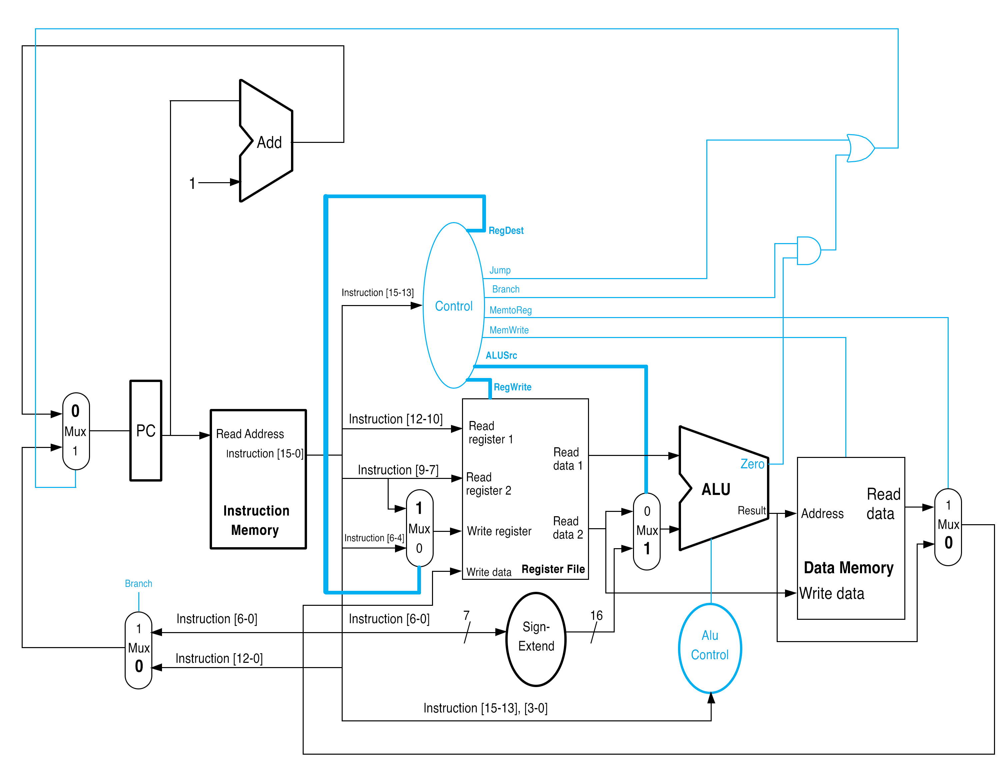

# 16-bit Computer in Verilog
## Instruction Set Architecture

### Explanation of design
This processor handles instructions that are 16 bit in length. This was chosen to allow for flexibility in creating a RISC-based processor that was inspired by MIPS. The data-width of the ALU is also 16 bits in length, allowing the processor to be considered 16 
bit. There are 8 registers in total, ```X0-X7```, which each hold 16 bits of data. This means that each register is represented in 3 bits. Opcodes are consitently 3 bit in length, no matter the instruction given to the processor. The processor supports three types of instruction ```R```, ```I```,  and ```J```. ``R`` contains all instructions that do not require an immediate value and deal with direct manipulation of registers. All instructions of the ``R`` type are ```000``` which allows for a simpler control (more details later). ```I``` type instructions handle immediate logical operations with registers but also includes loading, storing and branching which all do involve an immediate operations. This was chosen as both load, store, branching and traditional immediate instructions add a register to an offset, allowing for easier decoding of instructions.  ```J``` type is reserved for a single instruction, ``Jump``, which consists of an unconditional jump to an address in instruction memory. The PC is 16 bits long so PC is incremented by 1 after each non branch/jump instruction.
### ISA


As seen above, the use of `000` for all ``R`` type instructions allows for additional instructions while still have only 3 bits of opcode availability. To allow for easy decoding, `R[rs]` is always bits 12-10 in an instruction as it is always an ALU operand. The other operand is decided by the control. There are 4 bits for ```function``` and 6 bits for ```immediate```.

#### Register Name and Conventions 
| Name  | Number | Use |
| :-------------: | :-------------: | :-------------: |
|```X0-X6```  | 0-6  | General Purpose Registers |
| ```X7``` | 7  | Always Zero |


## Components
### Instruction Memory
When the computer is run, instruction memory is preloaded with the proper instructions that are to be performed using `$readmemb`. The program counter, which starts at 0, is inputed into the read address of instruction memory and instruction memory returns the 16 bit instruction at the designated address.
Instruction memory is 256 lines long with each line being 2 bytes. This is because each instruction is 16 bit. This also means instructions of at most 256 lines are supported. The 16 bit output instruction is decoded by the control and multiplexers. The implementation of instruction memory is in ```./mem/imem.v```.
### Register File
The Register File is a memory unit that is designed to emulate the fast memory that is stored in CPU registers. Since there are only 8 addressable registers, there are only 8 registers initialized in the file. Writes occur on the positive edge of the incoming clock cycle and only when writing is enabled.  The register file recieves 4 inputs, ```Read register 1```, ```Read register 2```, ```Read register 2```, ```Write Register```, and```Write data```,  ```Write Register```, and ```Write data``` are both decided by the control and will be explained in the control section. ```Read register 1``` is always ```instruction [12-10]```. ```Read Data 1``` and ```Read data 2``` return the respective values at the designated register number of ```Read register 1``` and ```Read register 2```. The implementation of the register file is in ```./regfile/regfile.v```.


### Control
The control recieves the opcode, ```instruction [15-13]```, and outputs 1 bit control signals to determine which components of the CPU should be used and what values they should receive. There are 7 control signals which are denoted below. 
#### Control Signals

| Opcode | Command | Jump | Branch | MemWrite | RegWrite | ALUsrc | RegDest | MemtoReg |
|:--------:|:---------:|:------:|:--------:|:----------:|:----------:|:--------:|:----------:|:----------:|
| 000    | R-Type  | 0    | 0      | 0        | 1        | 0      | 0        | 0        |
| 001    | ADDI    | 0    | 0      | 0        | 1        | 1      | 1        | 0        |
| 010    | SUBI    | 0    | 0      | 0        | 1        | 1      | 1        | 0        |
| 011    | ST      | 0    | 0      | 1        | 0        | 1      | 1        | 0        |
| 100    | LD      | 0    | 0      | 0        | 1        | 1      | 1        | 1        |
| 101    | Jump    | 1    | 0      | 0        | 0        | 0      | 0        | 0        |
| 101    | BEQ     | 0    | 1      | 0        | 0        | 0      | 0        | 0        |

Since all ```R``` instructions only write to a register, the same opcode is used for all of the instructions of this type.

| Control Signal | Assertion Effect |
|:--------:|:---------:|
| Jump    | The PC will jump to the 13 bit address that is specified in the instruction. |
| Branch    | isZero must also be asserted to allow for branching to the 7 bit immmediate.    | 
| MemWrite    | Data memory can be written to.  |
| RegWrite   | The register file can be written too.     | 
| ALUSrc    | ALUSrc puts the sign-extended 7 bit immediate into the second ALU operand, otherwise it will be `R[rt]`.    | 
| RegDest   | RegDest allows for the write register of the register file to be set to ``rt``, otherwise it will ``rd``.   | 
|MemtoReg   | MemtoReg allows for the data read from data memory to be the write data of the register file otherwise it is the ALU Result.    | 

The implementation of the control is in ```control.v```.
### ALU
The ALU accepts two 16 bit operands and returns a result and an ```isZero```. ```isZero``` is asserted when the result from the ALU operation is zero. The ALU performs subtraction in two's complement allowing for negative numbers. This also means the supported range of numbers stored on this computer is [-2^15 : 2^15 - 1]. This is implmented in ```./alu/alu.v```.
#### ALU Control
The ALU Control uses the opcode and function to determine the appropriate ALU operation. These are denoted below.
| opcode | function | ALU opcode | Operation Done |
| :---: | :---: | :---: | :---: |
| 000 | 0000 | 000 | ADD |
| 000 | 0001 | 001 | SUB |
| 000 | 0110 | 110 | NOT |
| 000 | 0011 | 011 | SLT |
| 000 | 0100 | 100 | AND|
| 000 | 0101 | 101 | OR |
| 000 | 0111 | 111 | XOR |
| 001 | x | 000 | ADD |
| 010 | x | 001 | SUB |
| 011 | x | 000 | ADD |
| 100 | x | 000 | ADD |
| 110 | x| 001 | SUB |

This is implemented in `./control/aluctrl.v`.
### Data Path
The datapath allows for all of the components of the computer to be connected. It is implemented directly inside of the testbench ```cpu.v```.
Instructions are also decoded in ```cpu.v``` as wires are assigned for different components of the instruction and are put the control and muxes. This will be more explicit in the diagram section.

### Data Memory
Data memory recieves an input of a 16 bit address from the ALU Result and is where data outside of registers can be written and read from. This means that there are 16 bits of addressable memory, 65536 lines of memory in which each is 2 bytes each. However, since ``LD``, ``ST`` and ``ADDI`` only support 7 bit immediates, loading address in memory that took more than 7 bits to address would take multiple insturctions to load/store registers which is why 256 lines of memory were chosen. Also, 256 different spots in memory to address is already much more than needed for the programs which were run on this processor.

## Visual Diagram
### Diagram of the Processor 


### R-type instruction
#### ```ADD```


```Instruction [15-13]``` (opcode)  is sent to the control and realized as ```000```. This indicates that ```RegWrite``` should be the only control signal set to high. This allows for ```rd``` or `Instruction [6-4]` to be sent to the write register as the multiplixer will allow for it to pass as `RegDest` is low. `ALUSrc` is low making `R[rt]` (which is `Read data 1`) to be sent to the second ALU operand by a multiplexer. The ALU control uses `Instruction [15-13]` and `Instruction[3-0]` to determine what ALU operation should be performed. In this case, function is `0000` so the ALU Operation is `000` or `ADD`. The ALU Result is then put into the ```Write data``` input for the register file as `MemtoReg` is low.


### I-type instruction

#### ```ADDI```


```Instruction [15-13]``` (opcode)  is sent to the controller and realized as ```001```. This causes `RegDest`, `ALUSrc`, and `RegWrite` to be set to high. This causes `rt` to be set to the Write register for the register file and the sign-extended immediate from `Instruction [6-0]` becomes the second ALU operand as the multiplixer before the ALU becomes 1. In addition, the destination of the operation is set to `rt` as the type is an immediate which is indicated by `RegDest` being high. he ALU control uses `Instruction [15-13]` and `Instruction [3-0]` to determine that an add operation should occur in the ALU. Since memory is not written to or has data taken from it, the ALU Result is stored in the write register `rt` which is the operation of `R[rs] + immediate`.


#### ```ST```


`RegDest`, `MemWrite`, and `ALUSrc` are all set to high meaning the operands of the ALU are the same as `ADDI` example. However, the addition of `MemWrite` being high forces `R[rt]` to be written to the address in data memory indicated by ALU Result. Also, `RegWrite` is now low meaning nothing will be written to the write register.

#### ```LD```


This has the same path as the previous `ADDI` except for what is written to `rt`. This is why it was also chosen to be an immediate. `MemtoReg` is now high. This causes the ALU Result to be the data memory address and the data written to `rt` now becomes what is at the memory address.

#### ```BEQ```


`Branch` is high and the ALU operands become `R[rs]` and `R[rt]` as no other control signals that manipulate the second operand are high. The ALU Control produces as `001` or `SUB` operation which is performed and if the result is zero `isZero` becomes high. This goes into the and gate on the top right and both `branch` and `isZero` are high in the diagram meaning the or gate will output a high. Also, `branch` causes the multiplexer on the bottom left to output `Instruction [6-0]`. Since the input to the multiplixer inputing to the programming counter is 1, `Instruction [6-0]` (immediate) becomes the new PC executing a branch on equality.


### J-type instruction

#### ```JUMP```


As `Jump` is high, the or gate will output a high signal. All the operations occuring in the processor are disregarded, and `branch` is low causing `Instruction [12-0]` to pass to the multiplixer inputing into the PC. Since this multiplixer recieves a high signal, `Instruction [12-0]` is free to pass into the PC and become the next PC instead of PC = PC + 1. 


## How to Run Instructions
To run the instructions type the the compiled machine code into ``precode.txt``, dashes can be used to help write the code and make it easier to view. Then run ``./remover.sh`` to remove the dashes and also move the machne code into ``code.txt`` where the computer reads it from. To run the program, compile ```cpu.v``` using ```iverilog -o cpu cpu.v```.  

## Sample Programs
### Fibonacci
The first sample program is an iterative function to caclulate the nth Fibonacci number.

#### C Code
```c
int fib(int i) {
    int num1 = 0;
    int num2 = 1;
    int num3;

    for(int n = 1; n < i; n++){
        num3 = num1 + num2;
        num1 = num2;
        num2 = num3;
    }
    return num1;
} 
```

#### Assembly Code

Assume ``X1 = num1``, ``X2 = num2``, ``X3 = num3``, ``X5 = n``, and ``X0 = i``. Result in ``X1``. 
```
    ADDI X2, XZR, #1    //Set X2 to be 1
    ADDI X5, XZR, #1    //Sets counts to start at 1
    ADDI X6, XZR, #1    //Sets X6 to ve zero to check later
    ADDI x0, XZR, #7    //Sets X0 to the fib number we want to calculate
FIB:
    ADD  X3, X2, X1     //X3 equal to two previous answers
    ADD  X1, X2, XZR    //X1 = X2
    ADD  X2, X3, XZR    //X2 = X3
    ADDI X5, X5, #1     //Adds 1 to the count
    SLT  X4, X5, X0     //Checks if the count is less than the input
    BEQ  X4, X6, FIB    //If The count is less than the input, the program branches to fib
HALT                    //Stops the program

```
#### Machine Code 
```
0011110100000001
0011111010000001
0011111100000001
0011110000000111
0000100010110000
0000101110010000
0000111110100000
0011011010000001
0001010001000011
1101001100000100
1111111111111111
```

### Sample Program 2
Since the first sample program did not show loading, storing, or an unconditional branch, a second sample program was created to display these features.

#### Assembly Code
```
    ADDI X0, XZR, #3    //X0 = 3 
    ADDI X1, XZR, #5    //X1 = 5
    ST   X0, [X2, #0]   //Stores X0 in the address stored in X2
    ST   X1, [X2, #1]   //Stores X1 in the address stored in X2 shifted over 2 bytes
    J    Skip           //Jumps to skip
    SUBI X0, X1, #1     //X0 = X1 - 1
    ST   X0, [X2, #0]   //Stores X0 in X2
Skip:
    LD   X3, [X2, #0]   //Loads 3 since it skipped storing 4
    LD   X4, [X2, #1]   //Loads 5
HALT                    //Stops the Program
```

#### Machine Code
```
0011110000000011
0011110010000101
0110100000000000
0110100010000001
1010000000000111
0100010000000001
0110100000000000
1000100110000000
1000101000000001
1111111111111111
```

### Sample Program 3
This sample program is meant to test all of the alu opperations that were not shown in the previous two examples, to show that they work.

#### Assembly Code
```
ADDI X0, XZR, #13   //Sets X0 to be 1101
ADDI X1, XZR, #2    //Sets X1 to ve 0010
ADD  X2, X0,  X1    //X2 = X0 + X1, should be 1111
SUB  X2, X0,  X1    //X2 = X0 - X1, should be 1011
LSL  X2, X0,  X1    //X2 = X0 << X1, should be 110100
SLT  X2, X0,  X1    //Test is X0 < X1, should be 0
AND  X2, X0,  X1    //X2 = X0 & X1, should be 0000
OR   X2, X0,  X1    //X2 = X0 | X1, should be 1111
NOT  X2, X0         //X2 = !X1, should be 0010 (leading 0s become 1s)
XOR  X2, X0,  X1    //X2 = X0 ^ X1, should be 1111
HALT                //Stops the program
```

#### Machine Code
```
0011110000001101
0011110010000010
0000000010100000
0000000010100001
0000000010100010
0000000010100011
0000000010100100
0000000010100101
0000001110100110
0000000010100111
1111111111111111
```

## Time Diagrams
To show the process that the computer goes through when running each of the possible different types of commands, timming diagrams were made in GTKWave. Because of how this processor was designed, each command takes one clock cycle to run, which is 40 ns. One thing to note is that the first command is only displayed for 20 ns on GTKWave since at 0 ns a falling edge occures.

### R-Type
For this example ``X0`` is initialized to be 1, and ``X1`` is initialized as 2.
#### Assembly Code
```
ADD X0, X1, X0
SUB X0, X0, X1
HALT
```
#### Timing Diagram


At 0 ns, the command ``ADD X0, X1, X0`` is ran, the instructions and opcode are set to what they each should be for the command. Since this is an R-Type of instruction, the only flag that is on is the ``regwrite``. 

At 20 ns, the next instruction is ran, this one being ``SUB X0, X1, X1``. One notable differences between this instruction and the last instuction is the last nibble of the ``instruction[15:0]`` being 0x1 instead of 0x0 since the function for ``SUB`` is 0001 instead of 0000. Another one is that ``rs[2:0]`` and ``rt[2:0]`` are fliped. Since both isntructions are an R-Type the ``opcode[2:0]`` remains the same.

### I-Type
To display all the I type of instructions, a slight variation of sample program 2 will be used, replacing the uncondition jump with a branch if equal to.

#### Assembly code
```
    ADDI X0, XZR, #3    //X0 = 3 
    ADDI X1, XZR, #5    //X1 = 5
    ST   X0, [X2, #0]   //Stores X0 in the address stored in X2
    ST   X1, [X2, #1]   //Stores X1 in the address stored in X2 shifted over 2 bytes
    BEQ  X0, X0, Skip   //Jumps to skip
    SUBI X0, X1, #1     //X0 = X1 - 1
    ST   X0, [X2, #0]   //Stores X0 in X2
Skip:
    LD   X3, [X2, #0]   //Loads 3 since it skipped storing 4
    LD   X4, [X2, #1]   //Loads 5
HALT                    //Stops the Program
```
#### Timing Diagram


At 0 ns, the instruction ``ADDI X0, XZR, #3`` is run. Since this, as well as all of the other instructions ran in this test program, the ``immediate[6:0]`` is set to the immediate in the instruction. For this instruction it is then summed with the zero register.

At 20 ns, the next instruction is run. This instruction is very simmilar to the last except ``rt[2:0]`` and ``immediate[6:0]`` are changed.

At 60 ns, ``ST X0, [X2, #0]`` is ran. Since this instruction writes to memory, the ``memwrite`` flag is high. ``immediate[6:0]`` is set to 0 since there is no shift. For this instruction ``res`` is equal to the location in memory that ``X0`` is stores in, this location is equal to the memory address inside ``X2`` plus the shift amount.

At 100 ns, ``ST X1, [X2, #1]`` is ran. This instruction is very simmilar to the last instruct with ``rt[2:0]`` changing since a different register is being wrote to memory as well as ``immediate[6:0]`` changing since the shift amount is now 1 instead of 0.

At 140 ns, ``BEQ X0, X0, SKIP`` is ran. Since this is a branch command, and the conditions needed to branch were met, the only flag to be high is ``branch``. In the instruction, it is suposed to branch to ``Skip`` which is line 7 of the program, because of this, the ``immediate[6:0]`` is equal to 7. One other thing to note is that the ``pc[15:0]`` for this command is equal to 4.

At 160 ns, the command ``LD X3, [X2, #0]`` is ran. While the ``pc[15:0]`` for the last command was 4, it has now jumped up to 7 because the last line was a branch instruction. Since this command is a load ``memtoreg`` is high and ``mem_out[15:0]`` is equal to the value in memory that the load command is pointing to. Also, since the load command has no offset ``immediate[6:0]`` is set to 0.

At 220 ns, the command ``LD X4, [X2, #0]`` is ran. Like the last command ``memtoreg`` is high since this command loads information from memory to a register. ``mem_out[15:0]`` is equal to 5 since this is the value stored at address ``X2`` with an offeset equal to the ``immediate[7:0]`` which is 1.


### J-Type
For this example, ``X0`` is again preloaded with a 1 and ``X1`` is preloaded with a 2.0s

#### Assembly Code
```
    J SKIP
    SUB X0, X1, X0
SKIP:
    ADD X0, X1, X0
HALT
```

#### Timing Diagram


At 0 ns, the instruction ``J SKIP`` is ran. Two things to note about this instruction is that the ``jump`` flag is set to high, because it is a jump, and ``jumpaddr[12:0]`` is set to 2, since that is the location of ``SKIP``. 

At 20 ns, the instruction ``ADD X0, X1, X0`` is ran. One thing to note is that the ``pc[15:0]`` jumps from 0 in the alst instruction, to 2 because of the jump. Since this command adds ``X0`` and ``X1`` the ``res[15:0]`` is equal to 3.

## References
*Computer Organization and Design: The Hardware/Software Interface, ARM® Edition*, David A. Patterson & John L. Hennesey

*Verilog by Example: A Concise Introduction for FPGA Design*, Blaine Readler

*The Paradigm Recursion: Is It More Accessible When Introduced in Middle School?*. Gunion, Katherine & Milford, Todd & Stege, Ulrike. (2009). The Journal of Problem Solving.